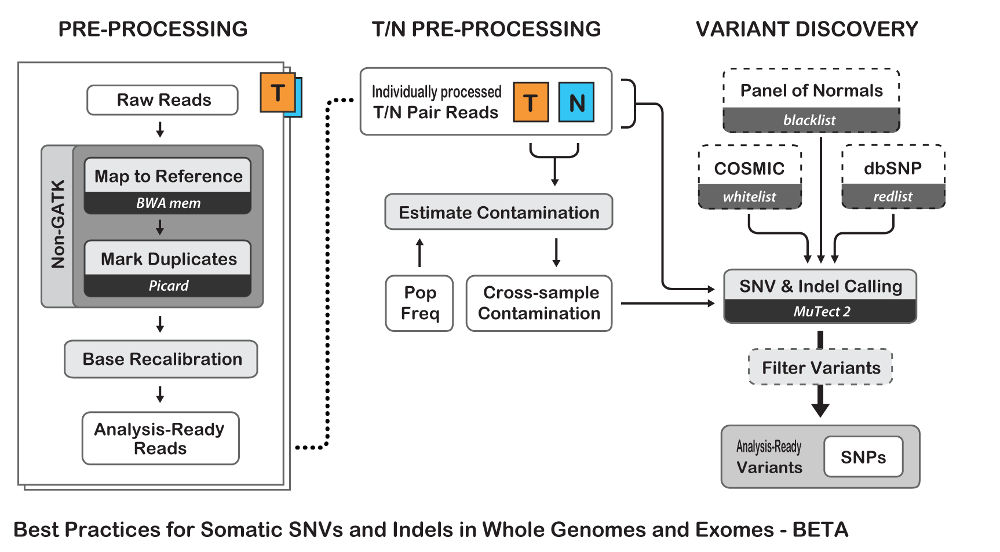

# Somatic Variant Calling Pipeline

This pipeline is based on GATK best practices for somatic variant calling Tumor matched Normal NGS dataset.

## Workflow

## Dependencies

|Software|Databases|
|:------:|:-------:|
|||
|||
|||
|||

### Software

### Databases/References

## Ressources

- [Best Practices for Somatic SNV and Indel Discovery in Whole Genome and Exome Sequence (BETA)](https://software.broadinstitute.org/gatk/best-practices/mutect2.php)

- [GATK workshop : 2017 Feb workshop presentation slides and tutorial materials](https://software.broadinstitute.org/gatk/blog?id=9044)
	- [Call somatic SNVs and indels using GATK MuTect2](https://drive.google.com/file/d/0BwTg3aXzGxEDdXRsY1hWdzU5TzQ/view)
